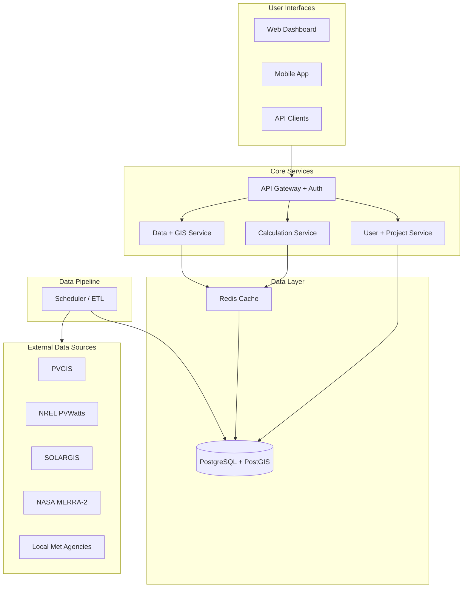

# Solar Off-Grid Energy System Calculator - High-Level Design (HLD)

## 1. Purpose
Build a software system that calculates off-grid solar energy system sizing based on energy needs and backup time, optimized for West African conditions. Future phases expand to North and Southern Africa.

## 2. Scope
### In Scope (MVP - West Africa)
- Location-based solar resource assessment.
- Load analysis and sizing for PV array, battery, inverter, and charge controller.
- System loss modeling (temperature, wiring, conversion, dust).
- Data source transparency (show source and update timestamp).
- Reporting (PDF spec sheet, bill of materials summary).

### Out of Scope (MVP)
- Real-time monitoring of installed systems.
- Automated procurement and vendor pricing integration.
- Full offline-first mobile sync with background updates (phase 2+).

## 3. Goals and Success Criteria
- Accuracy within +/-10-15% for validated test systems.
- Transparent data provenance with reliable, reputable sources.
- Usable by installers, engineers, and NGOs in West Africa.

## 4. Stakeholders
- System designers and installers.
- NGOs and development agencies.
- End users (households, clinics, schools).
- Data providers and validation partners.

## 5. Assumptions
- Minimum internet access for initial data fetch.
- Users provide accurate load data and constraints.
- Data sources remain available and stable.

## 6. Reliable Data Sources
The system will prioritize authoritative, well-documented sources. Each dataset is tracked with a provenance record, update time, and license.

### Primary Sources (Always Included)
- PVGIS (EU Commission): GHI, DNI, DHI, temperature.
- NREL PVWatts (US NREL): performance modeling data.

### Regional Enhancement
- SOLARGIS (commercial satellite-derived irradiance).
- National meteorological agencies (country-specific validation).

### Validation and Historical Context
- NASA MERRA-2 (long-term weather and solar radiation datasets).
- Regional bodies (RCREEE for North Africa, SADC RE for Southern Africa).

## 7. Architecture Overview

### Conceptual Diagram

### Component Responsibilities
- API Gateway: authentication, rate limiting, request validation.
- Calculation Service: core sizing algorithms and loss modeling.
- Data/GIS Service: location lookup, irradiance queries, regional metadata.
- User/Project Service: user accounts, project configuration, history.
- Data Pipeline: scheduled refresh and validation of solar datasets.

## 8. Core Calculation Modules

### 8.1 Energy Requirement Analysis
- Inputs: appliance list, usage patterns, daily/monthly kWh.
- Outputs: load profile, peak load, seasonality adjustment.

### 8.2 Solar Resource Assessment
- Inputs: latitude, longitude, tilt, azimuth.
- Outputs: monthly irradiance profile, temperature data.

### 8.3 PV Array Sizing
$$
PV\_Size\_kWp = \frac{Daily\_Energy \times Loss\_Factor \times Safety\_Factor}{Peak\_Sun\_Hours \times Panel\_Efficiency}
$$
- West Africa adjustment: dust and heat derating.

### 8.4 Battery Sizing
$$
Battery\_Capacity\_kWh = \frac{Daily\_Energy \times Autonomy\_Days}{Depth\_of\_Discharge}
$$
- West Africa adjustment: high-temperature lifespan impact.

### 8.5 Inverter and Charge Controller
- Inputs: peak load, PV array size, system voltage.
- Outputs: inverter rating, controller amperage.

### 8.6 System Loss Modeling
- Wiring losses (5-7%), controller losses (3-5%), inverter losses (10-15%), temperature derating (up to 30%).

## 9. Data Model (High-Level)
- Location: region, latitude, longitude, climate zone.
- SolarData: monthly irradiance, temperature, source provenance.
- Project: user, location, load profile, results.
- CalculationResult: PV size, battery size, inverter rating, losses.

## 10. Non-Functional Requirements
- Reliability: cached results for high-traffic locations.
- Transparency: show source and data timestamp per calculation.
- Performance: typical calculation under 2 seconds for cached locations.
- Security: API key management and rate limiting.

## 11. Validation Strategy
- Cross-check against deployed systems in Ghana, Nigeria, Senegal, Cote d'Ivoire.
- Adjust loss factors with field data.
- Peer review from regional renewable energy organizations.

## 12. Risks and Mitigations
- Data outages: multi-source fallback and caching.
- Inconsistent user input: input validation and guided forms.
- Regional variability: climate-zone-based adjustments.

## 13. Roadmap Reference
See [ROADMAP.md](ROADMAP.md) for phased implementation.
